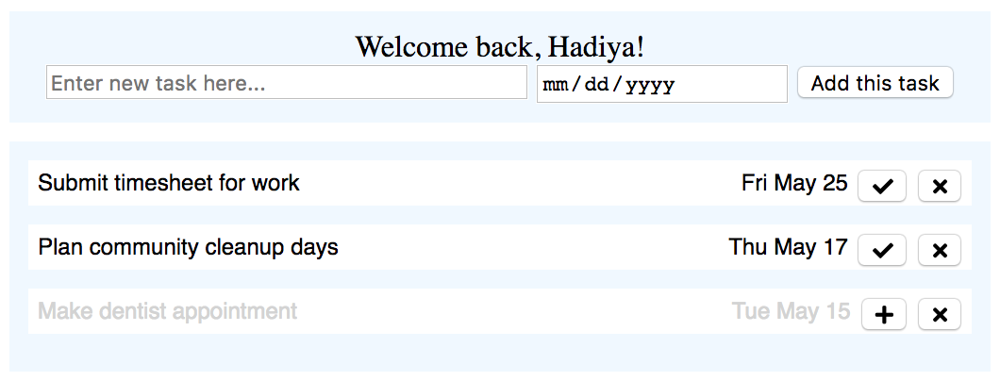

# godo
Simple todo list using rest API, gorm, and postgres db with Go

Done:
 - Setup database CRUD calls
 - Setup routers for rest API
 - Add a task
 - Delete a task
 - Complete/Uncomplete a task
 - Login with name
 - Tasks sorted by date
 - Missed tasks marked
 - Dates contextualized, Yesterday, Today, Tomorrow
 - User that created task also saved with task, and now visible on list
 - Tasks without due dates can be added
