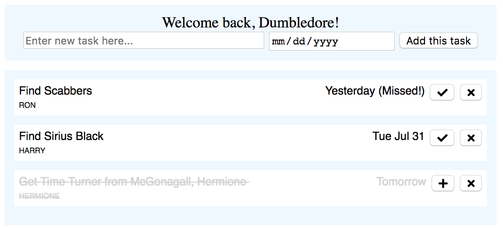

# godo
Simple todo list using rest API, gorm, and postgres db with Go

Done:
 - Setup database CRUD calls
 - Setup routers for rest API
 - Add a task
 - Delete a task
 - Complete/Uncomplete a task
 - Login with name
 - Sort tasks
